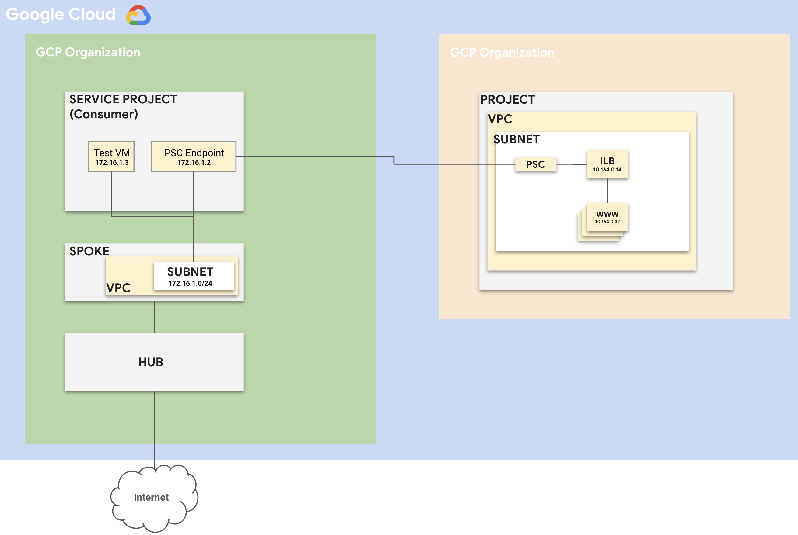
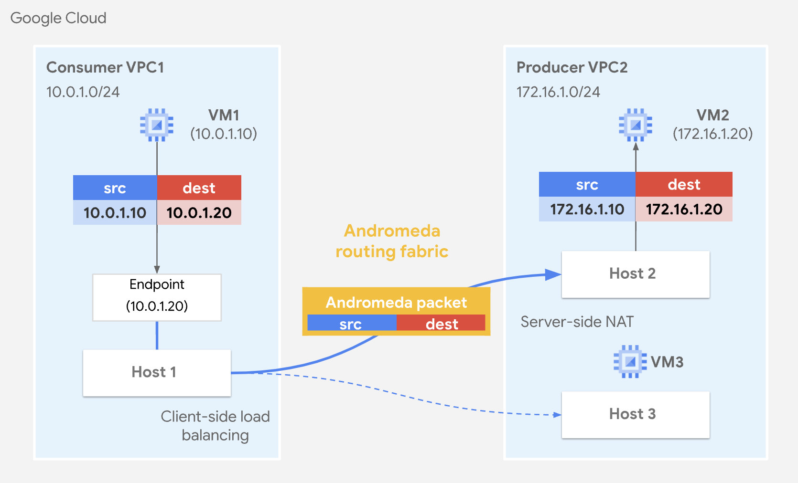

# Google Cloud Private Service Connect

## Overview

**Private Service Connect** is a Google Cloud feature that enables you to securely and privately connect your Virtual Private Cloud (VPC) networks to Google services or third-party services. By using Private Service Connect, you can access services over private IP addresses, eliminating the need for public IPs and exposing your traffic to the public internet.

## Key Features

- **Private Connectivity**: Establish private connections to services without traversing the public internet.
- **Service Endpoints**: Create private endpoints in your VPC to access Google APIs and services.
- **Simplified Network Management**: Manage private connections seamlessly through Google Cloud's managed services.
- **Enhanced Security**: Keep your traffic within Google's network and apply security policies like VPC Service Controls.

## How Private Service Connect Works

Private Service Connect allows you to create a private endpoint within your VPC network. Traffic sent to this endpoint remains within Google's network, providing low latency and high security.

There are two primary models:

1. **Consumer Initiated Connections**: For accessing Google-managed services privately.
2. **Producer Initiated Connections**: For service providers to expose services privately to consumer VPCs. **THIS IS WHAT WE WILL FOCUS ON**

### Producer Initiated Connections

- **Expose Services Privately**: Service producers create forwarding rules and target proxies to make their services available over Private Service Connect.
- **Consumer Connectivity**: Consumers connect to the private service using the service attachment provided by the producer.

## Use Cases

In this usecase we will explore the use of PSC to connect across multiple projects, in this case PSC is being used due to the following reasons:

1. **Overlapping Address Range**: The two projects may have overlapping address range which could cause issues with routing if the two projects are peered.
2. **VPC Peering - Transit Routing**: You may run into transit routing issues where peering may not be a viable solution.
3. **Security**: You may not want to allow full communication between the two projects (even with firewall rules governing the traffic).

**NOTE: IN THIS USECASE WE WILL FOCUS ON PRIVATE SERVICE CONNECT BETWEEN TWO USER OWNED PROJECTS**

## Architecture



Private Service Connect is implemented by using software-defined networking (SDN) from Google Cloud called Andromeda (PDF). Andromeda is the distributed control plane and data plane for Google Cloud networking that enables networking for Virtual Private Cloud (VPC) networks. The Andromeda networking fabric processes packets on the physical servers that host VMs. As a result, the data plane is fully distributed and has no centralized bottlenecks on intermediate proxies or appliances.

### Andromeda Architecture


From a logical perspective, there are consumer Private Service Connect endpoints and producer load balancers. However, from a physical perspective traffic goes directly from the physical server that hosts the client VM to the physical server that hosts the producer load balancer VM.

Andromeda applies functions to Private Service Connect traffic as shown in the following diagram:

1. Client-side load balancing is applied on the source host (Host 1) which decides which target host to send the traffic to. This decision is based on location, load and health.

2. The inner packet from VPC1 is encapsulated in an Andromeda header with the destination network of VPC2.

3. The destination host (Host 2) applies SNAT and DNAT to the packet, using the NAT subnet as the source IP address range of the packet and the producer load balancer IP address as the destination IP address.

There are exceptions where traffic is processed by intermediate routing hosts, such as inter-regional traffic or very small or intermittent traffic flows. However, Andromeda dynamically offloads traffic flows for direct, host-to-host networking whenever possible to optimize for best latency and throughput.

## Setting Up Private Service Connect

You may refer to the following documentation for configuration:

- [Configure PSC Producer](https://cloud.google.com/vpc/docs/configure-private-service-connect-producer)
- [Configure PSC Consumer](https://cloud.google.com/vpc/docs/configure-private-service-connect-services)

**NOTE: IN THIS SETUP WE ARE FOCUSING ON PUBLISHED SERVICE BUT THE SAME CONCEPTS CAN BE ADOPTED FOR OTHER USECASES**

## Packet Captures

### Traffic Direction: Test VM ==> www

**Capture on the Test VM**:
```
IP 172.16.1.3.39602 > 172.16.1.2.80: Flags [S], seq 2406371559, win 65320, options [mss 1420,sackOK,TS val 1608633698 ecr 0,nop,wscale 7], length 0
```

Traffic is originating from the test VM and is destained for the defined PSC endpoint.


**Capture on the www VM**
```
IP 10.120.0.5.54012 > 10.164.0.32.80: Flags [S], seq 3892719157, win 65535, options [mss 1420,sackOK,TS val 2565957808 ecr 0,nop,wscale 8], length 0
```

NOTE: **10.120.0.0/24** IS THE PROXY-ONLY SUBNET (TRAFFIC SOURCED FROM ILB)

### Traffic Direction: www ==> Test VM

**Capture on the Test VM**:
```
IP 172.16.1.2.80 > 172.16.1.3.47020: Flags [.], ack 77, win 1051, options [nop,nop,TS val 4146111935 ecr 1609336475], length 0
```

The traffic orignating from PSC Endpoint and Destained for the Test VM.

**Capture on the www VM**
```
IP 10.164.0.32.80 > 10.120.0.3.42258: Flags [F.], seq 434, ack 160, win 505, options [nop,nop,TS val 1318349573 ecr 1934326883], length 0
```

NOTE: **10.120.0.0/24** IS THE PROXY-ONLY SUBNET (TRAFFIC DESTAINED FROM ILB PROXY [ENVOY])

## References:
- [Internal Application Load Balancer Architecture](https://cloud.google.com/load-balancing/docs/l7-internal)

